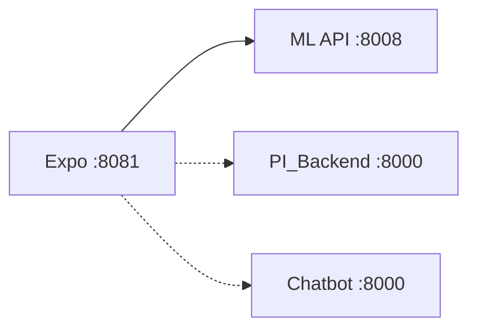

# Bovitech — Multimodal Cattle Monitoring

**GitHub repository:** `Esprit-PI-3IA5-25265-Bovitech`  
**Class:** 3IA5 · **Academic year:** 2025–2026  
**Institution:** [ESPRIT School of Engineering](https://esprit.tn/)

---

## Description

**Bovitech** is a smart cattle monitoring platform (PIDEV, ESPRIT). It combines IMU collars, barn environment (THI), acoustics, and herd context to assess behavior, stress, milk production, vocalizations, and health indicators.

- **Mobile app** — React Native (Expo), `main-bovitech-main/`
- **ML API** — Python inference, `src/model_http_api.py`, port **8008**
- **Optional** — PI_Backend (auth, herds) and chatbot (Groq + skin analysis), port **8000**

> Model weights, datasets, and database files are **not in Git**. Models download on first API start; the database is created empty and filled when farmers register in the app.

---

## Quick start (< 10 min)

**Need:** Docker Desktop (recommended), Git, Node.js 18+.

### One-time setup

```bash
git clone https://github.com/Bovitech/Esprit-PI-3IA5-25265-Bovitech.git
cd Esprit-PI-3IA5-25265-Bovitech

cp .env.example .env          # Windows: copy .env.example .env

cd main-bovitech-main && npm install && cd ..

docker compose -f docker/docker-compose.yml up --build
```

Wait for `Model API listening on http://0.0.0.0:8008`, then:

```bash
curl http://127.0.0.1:8008/health
```

Models are saved automatically under `finale_model/`, `gps_tracking/models/`, and `bovitech-chatbot-main/models/`.

### Every session

**Terminal 1** (repo root):

```bash
docker compose -f docker/docker-compose.yml up
```

**Terminal 2:**

```bash
cd main-bovitech-main && npm run web
```

Open **http://localhost:8081** — the app uses the ML API at **http://127.0.0.1:8008**.

### Manual setup (no Docker)

```bash
python -m venv .venv && .venv\Scripts\activate    # source .venv/bin/activate on Linux/macOS
pip install -r requirements.txt
cp .env.example .env
cd main-bovitech-main && npm install && cd ..
python scripts/download_models.py
```

Every session: `python src/model_http_api.py` + `npm run web` in `main-bovitech-main/`.

---

## Architecture



| Service | Required? | Port |
|---------|-----------|------|
| ML inference API | Yes | 8008 |
| Expo mobile app | Yes | 8081 |
| PI_Backend (auth, herds) | No | 8000 |
| Chatbot (Groq, skin) | No | 8000 |

Do not run PI_Backend and chatbot together — same port.

---

## Docker

> **Docker recommandé** — un seul conteneur ML (`docker/`), reproductible sur Windows, Linux et macOS.

```bash
docker compose -f docker/docker-compose.yml up --build
```

Expo still runs on the host. Set `SKIP_MODEL_DOWNLOAD=1` in `.env` once models are cached.

---

## Optional features

**Auth (PI_Backend)** — empty SQLite DB, no seed users; farmers register in the app.

```bash
cd PI_Backend && python manage.py migrate && python manage.py runserver
```

**Chatbot** — set `GROQ_API_KEY` in `.env`, then:

```bash
pip install -r bovitech-chatbot-main/requirements.txt
cd bovitech-chatbot-main/backend && python manage.py runserver
```

**Illness model** — when URL is in `scripts/models.manifest.json`: `python scripts/download_models.py`

---

## What's not in Git

| Item | How you get it |
|------|----------------|
| Model weights | Auto-download on first API start, or `python scripts/download_models.py` |
| Training datasets | [Kaggle](https://www.kaggle.com/) — see [data/README.md](data/README.md) |
| User database | `migrate` creates empty tables; users sign up via the app |

---

## AI models

Download once (or automatic on first API start):

```bash
python scripts/download_models.py
```

| Model | Algorithm | Weights | Training data (Kaggle) |
|-------|-----------|---------|------------------------|
| Behavior | Random Forest | [Amiiimi/Behaviour](https://huggingface.co/Amiiimi/Behaviour) | [MMCows](https://www.kaggle.com/datasets/hienvuvg/mmcows) |
| Milk | XGBoost | [Amiiimi/MilkProduction](https://huggingface.co/Amiiimi/MilkProduction) | [MMCows](https://www.kaggle.com/datasets/hienvuvg/mmcows) |
| Stress | BiLSTM | [Amiiimi/StressModel](https://huggingface.co/Amiiimi/StressModel) | [MMCows](https://www.kaggle.com/datasets/hienvuvg/mmcows) |
| Vocal | CNN | [Amiiimi/AudioModel](https://huggingface.co/Amiiimi/AudioModel) | [MMCows](https://www.kaggle.com/datasets/hienvuvg/mmcows) |
| GPS | LSTM | [Amiiimi/GPS](https://huggingface.co/Amiiimi/GPS) | [MMCows](https://www.kaggle.com/datasets/hienvuvg/mmcows) |
| Illness | PPO | TBD | [MMCows](https://www.kaggle.com/datasets/hienvuvg/mmcows) |
| Skin | EfficientNet-B3 | [Amiiimi/DiseaseClassification](https://huggingface.co/Amiiimi/DiseaseClassification) | [Cattle diseases](https://www.kaggle.com/datasets/devang03mgr/cattle-diseases-datasets) |

---

## Model performance

| Model | Metric | Value |
|-------|--------|-------|
| Behavior | Accuracy / Macro F1 | TBD |
| Stress | F1 / ROC-AUC | TBD |
| Milk | RMSE / MAE | TBD |
| Vocal | Accuracy | TBD |
| Illness | Accuracy | TBD |

---

## Technologies

React Native · Expo · Python · Django REST · SQLite · PyTorch · TensorFlow · scikit-learn · XGBoost · Docker · ESP32 · DHT22

Python 3.10+ · Node.js 18+

---

## Environment variables

Single file at repo root: copy `.env.example` → `.env` (never commit `.env`).

- `EXPO_PUBLIC_*` — mobile app URLs
- `SECRET_KEY`, `DEBUG`, `ALLOWED_HOSTS` — PI_Backend & chatbot
- `GROQ_API_KEY` — chatbot
- `SKIP_MODEL_DOWNLOAD`, model paths — ML API

---

## Hardware & docs

- **ESP32** + **DHT22** — barn sensors · **Smart collar** — IMU · **Phone** — Expo client  
- BOM & wiring: [docs/liste-materiel.md](docs/liste-materiel.md)  
- API reference: [docs/api.md](docs/api.md)

---

## Demo

**Video / screenshots:** TBD — run locally with [Quick start](#quick-start--10-min) above.

---

## Authors

Salah Ghanoui · Melek Amimi · Meryem Benani · Zeineb Moujehed · Maram Ben Farhat — 3IA5, 2025–2026

**Supervision:** Ms. Dorsaf Hrizi · Ms. Oumayma Guasmi

---

License: [MIT](LICENSE)
