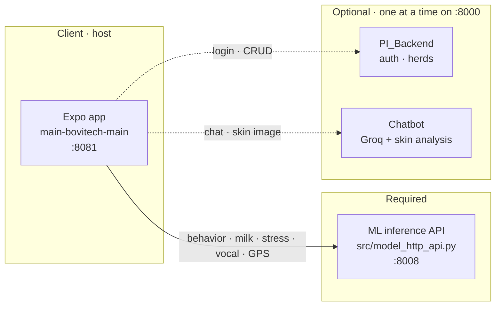
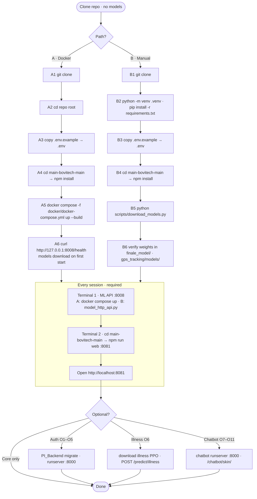

# Bovitech — Multimodal Cattle Monitoring

**GitHub repository:** `Esprit-PI-3IA5-25265-Bovitech`  
**Class:** 3IA5 · **Academic year:** 2025–2026  
**Institution:** [ESPRIT School of Engineering](https://esprit.tn/)

---

## Description

**Bovitech** is a smart cattle monitoring platform developed as part of the PIDEV project at ESPRIT. It combines signals from IMU collars, barn environment (THI index), acoustics, and herd context to assess behavior, stress, milk production, vocalizations, and certain health indicators.

A **React Native (Expo)** mobile app lets farmers interact with the system. Inference is handled by a dedicated **Python ML API**. An optional **Django REST backend** (PI_Backend) manages authentication and farm data.

> **Important:** trained model weights are **not in Git**. They are fetched automatically on first ML API start (Docker or `python scripts/download_models.py`).

---

## Visual flow

Start here. A new developer with **no models** and **no prior setup** can run the app in under 10 minutes.

### Architecture



### Setup paths

| Path | One-time setup | Every session | ML API |
|------|----------------|---------------|--------|
| **A · Docker** *(recommended)* | **A1–A6** | **A7–A10** | `docker compose -f docker/docker-compose.yml up` |
| **B · Manual** | **B1–B11** | **B12–B19** | `python src/model_http_api.py` |
| **Optional** *(both paths)* | — | **O1–O11** | PI_Backend / illness / chatbot (local venv) |



**Quick start (Path A — recommended):**

```bash
git clone https://github.com/Bovitech/Esprit-PI-3IA5-25265-Bovitech.git
cd Esprit-PI-3IA5-25265-Bovitech
copy .env.example .env
cd main-bovitech-main && npm install && cd ..
docker compose -f docker/docker-compose.yml up --build
# Terminal 2: cd main-bovitech-main && npm run web
```

Detailed steps: [Path A](#path-a--docker-recommended) · [Path B](#path-b--manual) · [Optional O1–O11](#optional--o1o11-both-paths) · [What works when](#what-works-when)

---

## Objectives

- Monitor cattle health in real time.
- Detect abnormal behavior.
- Estimate animal stress levels.
- Predict milk production.
- Provide decision support for farmers.

---

## Technologies

**Frontend:** React Native, Expo

**Backend:** Python, Django REST Framework, ML inference API

**Database:** SQLite

**AI / ML:** PyTorch, TensorFlow, scikit-learn, XGBoost, Stable-Baselines3


**Models:** Random Forest, XGBoost, BiLSTM, CNN, PPO, EfficientNet-B3

**Embedded:** ESP32, DHT22

Python 3.10+ · Node.js 18+

---

## Prerequisites

- **Docker Desktop** *(strongly recommended — [Visual flow](#visual-flow) Path A)*
- **Python 3.10+** and pip *(manual setup)*
- **Git**
- **Node.js 18+** (npm — mobile app in `main-bovitech-main/`)

```bash
pip install -r requirements.txt
cd main-bovitech-main && npm install && cd ..
```
- **ffmpeg** *(optional, vocal analysis)*

**Trained models** and **training datasets** are **not included** in the repository; only download scripts and manifests are versioned.

---

## Datasets

Training data is **not versioned in Git**. It is only needed to **retrain** models, not to run the app (inference uses weights from `python scripts/download_models.py`).

Place downloaded raw data under `data/raw/` and preprocessed data under `data/processed/` (see [data/README.md](data/README.md)).

### Primary sources (Kaggle)

| Source | Link | Used for |
|--------|------|----------|
| **MMCows** | [kaggle.com/datasets/hienvuvg/mmcows](https://www.kaggle.com/datasets/hienvuvg/mmcows) | Behavior, stress, milk, vocal, GPS, illness *(all models except skin disease)* |
| **Cattle diseases** | [kaggle.com/datasets/devang03mgr/cattle-diseases-datasets](https://www.kaggle.com/datasets/devang03mgr/cattle-diseases-datasets) | Skin disease EfficientNet-B3 ([Amiiimi/DiseaseClassification](https://huggingface.co/Amiiimi/DiseaseClassification)) |

### Behavior dataset

- **Source:** Kaggle — [MMCows](https://www.kaggle.com/datasets/hienvuvg/mmcows)
- **Preparation:** Multimodal IMU collar CSV files; cleaning, temporal alignment, feature extraction, and sliding windows. See the behavior training scripts.

### Stress dataset

- **Source:** Kaggle — [MMCows](https://www.kaggle.com/datasets/hienvuvg/mmcows)
- **Preparation:** Sensor sequences (THI, temperature, posture) per cow; sliding windows and shifted labels. See `stress_sensor/data_pipeline.py`.

### Milk production dataset

- **Source:** Kaggle — [MMCows](https://www.kaggle.com/datasets/hienvuvg/mmcows)
- **Preparation:** Daily milk history coupled with behavioral features; XGBoost pipeline with derived variables.

### Vocalization dataset

- **Source:** Kaggle — [MMCows](https://www.kaggle.com/datasets/hienvuvg/mmcows)
- **Preparation:** Bovine audio recordings; spectrogram / MFCC conversion, normalization, train/validation split.

### Illness dataset (PPO)

- **Source:** Kaggle — [MMCows](https://www.kaggle.com/datasets/hienvuvg/mmcows)
- **Preparation:** Temporal herd states, rewards per health class; RL training (Stable-Baselines3 PPO).

### GPS / trajectory dataset

- **Source:** Kaggle — [MMCows](https://www.kaggle.com/datasets/hienvuvg/mmcows)
- **Preparation:** Position time series; normalization (scaler) and LSTM sequences.

### Skin dataset (chatbot / DiseaseClassification)

- **Source:** Kaggle — [Cattle diseases datasets](https://www.kaggle.com/datasets/devang03mgr/cattle-diseases-datasets)
- **Preparation:** Resizing, augmentation, EfficientNet-B3 training (chatbot module). Trained weights: [Amiiimi/DiseaseClassification](https://huggingface.co/Amiiimi/DiseaseClassification).

---

## AI Models

**Trained models are not stored in the Git repository** (size, licensing, ESPRIT best practices). After install, run **once**:

```bash
python scripts/download_models.py
```

This fetches all **required** weights: behavior, milk, stress, vocal, GPS ([Amiiimi/GPS](https://huggingface.co/Amiiimi/GPS)), and skin disease EfficientNet-B3 ([Amiiimi/DiseaseClassification](https://huggingface.co/Amiiimi/DiseaseClassification)). Illness PPO is optional until its URL is published.

Set `SKIP_MODEL_DOWNLOAD=1` in `.env` only if all files are already cached locally.

| Model | Algorithm | Hugging Face | Kaggle (training data) | Google Drive |
|-------|-----------|--------------|------------------------|--------------|
| Behavior | Random Forest | [Amiiimi/Behaviour](https://huggingface.co/Amiiimi/Behaviour) | [MMCows](https://www.kaggle.com/datasets/hienvuvg/mmcows) | TBD |
| Milk production | XGBoost | [Amiiimi/MilkProduction](https://huggingface.co/Amiiimi/MilkProduction) | [MMCows](https://www.kaggle.com/datasets/hienvuvg/mmcows) | TBD |
| Stress | BiLSTM | [Amiiimi/StressModel](https://huggingface.co/Amiiimi/StressModel) | [MMCows](https://www.kaggle.com/datasets/hienvuvg/mmcows) | TBD |
| Vocalization | CNN | [Amiiimi/AudioModel](https://huggingface.co/Amiiimi/AudioModel) | [MMCows](https://www.kaggle.com/datasets/hienvuvg/mmcows) | TBD |
| Illness | PPO | TBD | [MMCows](https://www.kaggle.com/datasets/hienvuvg/mmcows) | TBD |
| GPS / trajectory | LSTM | [Amiiimi/GPS](https://huggingface.co/Amiiimi/GPS) | [MMCows](https://www.kaggle.com/datasets/hienvuvg/mmcows) | TBD |
| Skin (chatbot) | EfficientNet-B3 | [Amiiimi/DiseaseClassification](https://huggingface.co/Amiiimi/DiseaseClassification) | [Cattle diseases](https://www.kaggle.com/datasets/devang03mgr/cattle-diseases-datasets) | TBD |

---

## 🐳 Docker rec

> **Utiliser Docker est fortement recommandé pour garantir la reproductibilité.**  
> Un projet IA avec Docker est beaucoup plus reproductible : **un seul conteneur** et **`docker compose -f docker/docker-compose.yml up --build`** suffisent, quelle que soit la machine (Windows, Linux, macOS).

One **Dockerfile** under `docker/` runs the ML inference API only (no multi-service stack). On first start it **downloads required model weights** automatically (same as `python scripts/download_models.py`).

```
docker/
├── Dockerfile
├── docker-compose.yml   # single service: api → :8008
└── .dockerignore
```

Build context is the **repo root** (`.dockerignore` at root is used during `docker compose build`).

### Quick start (Docker)

```bash
git clone https://github.com/Bovitech/Esprit-PI-3IA5-25265-Bovitech.git
cd Esprit-PI-3IA5-25265-Bovitech

copy .env.example .env          # cp .env.example .env on Linux / macOS
# Edit EXPO_PUBLIC_* URLs if needed (defaults target localhost:8008)

docker compose -f docker/docker-compose.yml up --build
```

Wait until you see `Model API listening on http://0.0.0.0:8008`, then check:

```bash
curl http://127.0.0.1:8008/health
```

**Mobile app** (Expo) still runs on the host — one terminal:

```bash
cd main-bovitech-main
npm install
npm run web
```

→ http://localhost:8081 (ML API at http://127.0.0.1:8008 from Docker)

| Item | Detail |
|------|--------|
| Image | One container — `docker/Dockerfile` |
| Service | `api` — `src/model_http_api.py` |
| Port | **8008** |
| Model cache | `./finale_model/`, `./gps_tracking/models/`, `./bovitech-chatbot-main/models/` (bind-mounted) |
| Skip auto-download | Set `SKIP_MODEL_DOWNLOAD=1` in `.env` if weights are already present |
| PI_Backend / chatbot | Not containerized — optional ([Visual flow](#visual-flow) **O1–O11**) |

Set `SKIP_MODEL_DOWNLOAD=1` only after models exist locally or in the mounted folders.

Path A step details: [Step-by-step reference · Path A](#path-a--docker-recommended).

---

## Step-by-step reference

Full command details for each path. Overview diagrams: [Visual flow](#visual-flow).

### Path A · Docker *(recommended)*

| Phase | Steps | When |
|-------|-------|------|
| One-time setup | A1–A6 | Once after clone |
| Run the app | A7–A10 | Every session |
| Optional | O1–O11 | Auth / illness / chatbot |

#### Steps A1–A6 · One-time setup (Docker)

```bash
git clone https://github.com/Bovitech/Esprit-PI-3IA5-25265-Bovitech.git
cd Esprit-PI-3IA5-25265-Bovitech

copy .env.example .env          # cp .env.example .env on Linux / macOS
# Edit EXPO_PUBLIC_* URLs, SECRET_KEY, GROQ_API_KEY (optional services)

cd main-bovitech-main
npm install
cd ..

docker compose -f docker/docker-compose.yml up --build
```

On **first start**, the container runs `python scripts/download_models.py --required-only` and saves weights on the host (bind mounts):

```
repo-root/
├── finale_model/                        ← behavior, milk, stress, vocal
├── gps_tracking/models/                 ← GPS LSTM + scaler
└── bovitech-chatbot-main/models/        ← skin EfficientNet-B3 (chatbot)
```

Verify **A6**:

```bash
curl http://127.0.0.1:8008/health
```

No Python venv or `pip install` needed for the ML API on this path.

#### Steps A7–A10 · Every session (Docker)

| Terminal | Command | URL |
|----------|---------|-----|
| 1 | `docker compose -f docker/docker-compose.yml up` | http://127.0.0.1:8008 |
| 2 | `cd main-bovitech-main` → `npm run web` | http://localhost:8081 |

```bash
# Terminal 1 (repo root)
docker compose -f docker/docker-compose.yml up

# Terminal 2
cd main-bovitech-main
npm run web
```

---

### Path B · Manual

| Phase | Steps | When |
|-------|-------|------|
| One-time setup | B1–B11 | Once after clone |
| Run the app | B12–B19 | Every session |
| Optional | O1–O11 | Auth / illness / chatbot |

#### Steps B1–B11 · One-time setup (Manual)

```bash
git clone https://github.com/Bovitech/Esprit-PI-3IA5-25265-Bovitech.git
cd Esprit-PI-3IA5-25265-Bovitech

python -m venv .venv
.venv\Scripts\activate          # Windows
# source .venv/bin/activate     # Linux / macOS

pip install -r requirements.txt

copy .env.example .env          # cp .env.example .env on Linux / macOS

cd main-bovitech-main
npm install
cd ..

python scripts/download_models.py
```

**B8 — the user does not move files manually.**  
`download_models.py` reads `scripts/models.manifest.json` and saves each weight to the path the ML API expects:

| Model | Purpose | Auto-saved to |
|-------|---------|---------------|
| Behavior RF | Collar activity | `finale_model/behavior_rf_multimodal.joblib` |
| Milk XGB | Milk production forecast | `finale_model/milk_xgb_pred_behavior_daily_milkhist_pipeline.joblib` |
| Stress BiLSTM | Early stress detection | `finale_model/StressDetectionV3_trained.pt` |
| Vocal CNN | Vocalization class | `finale_model/model_audio_classification (1).h5` |
| GPS LSTM | Cow trajectory | `gps_tracking/models/lstm_all.pth` |
| GPS scaler | GPS normalization | `gps_tracking/models/scaler_all.pkl` |
| Skin EfficientNet-B3 | Cow skin disease (chatbot) | `bovitech-chatbot-main/models/best_model.pth` |

Re-running **B8** is safe — existing files are skipped.

#### Steps B12–B19 · Every session (Manual)

| Terminal | Command | URL |
|----------|---------|-----|
| 1 | `python src/model_http_api.py` | http://127.0.0.1:8008 |
| 2 | `cd main-bovitech-main` → `npm run web` | http://localhost:8081 |

```bash
# Terminal 1
.venv\Scripts\activate
python src/model_http_api.py
curl http://127.0.0.1:8008/health

# Terminal 2
cd main-bovitech-main
npm run web
```

---

### Optional · O1–O11 (both paths)

Requires a **local Python venv** (`pip install -r requirements.txt`) — PI_Backend and chatbot are not in Docker.

| Phase | Steps | When |
|-------|-------|------|
| Auth | O1–O5 | Login / herds |
| Illness | O6 | When PPO URL is published |
| Chatbot | O7–O11 | Groq chat + skin analysis |

#### O1–O5 · PI_Backend auth

```bash
cd PI_Backend
python manage.py migrate
python manage.py createsuperuser
python manage.py runserver
```

→ http://127.0.0.1:8000 — `/api/auth/` · `/api/cows/` · `/admin/`

#### O6 · Illness model

When `illness_ppo.zip` has a URL in `scripts/models.manifest.json`:

```bash
python scripts/download_models.py
```

→ enables `POST /predict/illness`

#### O7–O11 · Skin chatbot

Do **not** run with PI_Backend — both use port **8000**.  
Skin weights are downloaded at setup (**A5** first start or **B8**) to `bovitech-chatbot-main/models/best_model.pth`.

```bash
pip install -r bovitech-chatbot-main/requirements.txt

cd bovitech-chatbot-main/backend
python manage.py runserver
```

→ http://127.0.0.1:8000/chatbot/skin/

---

### What works when

| Done | Farmer can use |
|------|----------------|
| Path A **A1–A6** or Path B **B1–B11** | Installed — start session steps |
| Path A **A7–A10** or Path B **B12–B19** | Behavior, milk, stress, vocal, GPS |
| + **O1–O5** | + login, register, herd CRUD |
| + **O6** | + illness health score |
| + **O7–O11** | + chatbot + skin image analysis |

**Key rules:** One **`.env`** at repo root · **Path A:** `docker compose` every session · **Path B:** venv + `model_http_api.py` every session · Expo (`npm run web`) on both paths

---

## Model Performance

| Model | Metric | Value |
|-------|--------|-------|
| Behavior | Accuracy | TBD |
| Behavior | Macro F1 | TBD |
| Stress | F1 Score | TBD |
| Stress | ROC-AUC | TBD |
| Milk production | RMSE | TBD |
| Milk production | MAE | TBD |
| Vocalization | Accuracy | TBD |
| Illness (PPO) | Accuracy | TBD |

---

## Hardware

| Component | Role |
|-----------|------|
| **ESP32** | IoT microcontroller, data collection and transmission |
| **DHT22** | Temperature / humidity sensor (THI calculation) |
| **Smart collar** | IMU and onboard sensors on cattle |
| **Android / iOS smartphone** | Mobile client via Expo Go or native build |

Full bill of materials (BOM), wiring diagrams, and supplier references: **[docs/liste-materiel.md](docs/liste-materiel.md)**

---

## Schematics and Documentation

Additional documentation in the `docs/` folder:

```
docs/
├── schema-cablage.png    # ESP32 / DHT22 wiring diagram (to be added)
├── api.md                # HTTP endpoint reference
└── liste-materiel.md     # Hardware list (BOM)
```

---

## Installation & Launch

**Recommended:** [Visual flow](#visual-flow) Path A — `docker compose -f docker/docker-compose.yml up --build` + Expo (`npm run web`).

**Manual setup:** [Visual flow](#visual-flow) Path B — **B1–B11** once, **B12–B19** every session.

---

## Environment Variables

One file at the **repo root**: copy `.env.example` → `.env` (never commit `.env`). All services read it:

| Section in `.env.example` | Used by |
|-----------------------------|---------|
| `EXPO_PUBLIC_*` | Mobile app (`main-bovitech-main`) |
| `SECRET_KEY`, `DEBUG`, `ALLOWED_HOSTS` | PI_Backend + Chatbot |
| `GROQ_API_KEY`, `CORS_*` | Chatbot |
| Model paths, `SKIP_MODEL_DOWNLOAD` | ML API (`model_http_api.py`) |

---

## Demo

**Local run:** follow **[Visual flow](#visual-flow)** Path A (**A7–A10**) or Path B (**B12–B19**).

**Demo video:** TBD

**Screenshots:**

- Home screen
- Dashboard
- Herd monitoring
- Prediction analysis

**Deployment:** TBD

---

## Authors

| Member | Class | Year |
|--------|-------|------|
| Salah Ghanoui | 3IA5 | 2025–2026 |
| Melek Amimi | 3IA5 | 2025–2026 |
| Meryem Benani | 3IA5 | 2025–2026 |
| Zeineb Moujehed | 3IA5 | 2025–2026 |
| Maram Ben Farhat | 3IA5 | 2025–2026 |

---

## Supervision

- Ms. **Dorsaf Hrizi**
- Ms. **Oumayma Guasmi**

---

License: [MIT](LICENSE)
